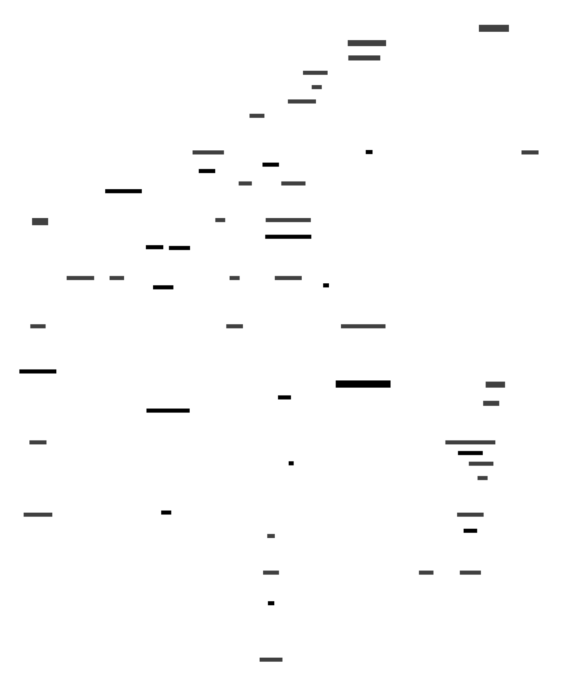

## Updating the diagram

The diagram is generated from [D2](https://d2lang.com/) code to allow versioning and rapid revisions. Install the [D2 CLI](dev-env-secret-pattern) and the D2 VSCode extension before editing the `.d2` files.

To update the svg, cd in to `./d2` and run `d2 --layout dagre <filename>.d2`. Add the `-w` flag for watch mode for a live-updating browser view while editing.

## Current Architecture

