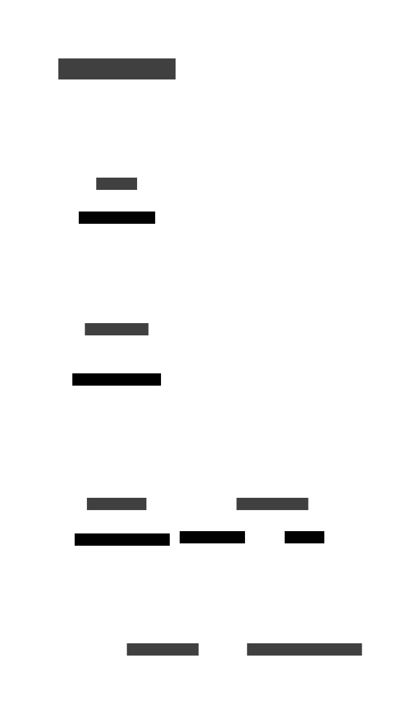

## IAM Changes Monitoring in Google Cloud Storage Buckets

The primary goal of this security control is to get immediate visibility when any important IAM changes happen to GCS buckets. This is achieved by creating a log-based metric that counts IAM changes and setting up alert policies based on that metric. This section outlines the process of setting up a security control to monitor IAM changes in Google Cloud Storage (GCS) buckets. The security control leverages Google Cloud's alerting and monitoring capabilities.



### Implementation Steps

#### 1. Create a notification channel.

Use Terraform to create a [notification channel](https://registry.terraform.io/providers/hashicorp/google/latest/docs/resources/monitoring_notification_channel) that is dedicated to receiving alerts for security changes. 


```terraform
resource "google_monitoring_notification_channel" "email_notification_channel" {
  type         = "email"
  labels = {
    email_address = "your-email@example.com"
  }
  force_delete = false
}
```

#### 2. Define a metric based on the logs

Define a counter [logging metric](https://registry.terraform.io/providers/hashicorp/google/latest/docs/resources/logging_metric) to track security changes in GCS buckets. The logs are filtered for resource type 'gcs_bucket' and specifically for 'storage.setIamPermissions' method in the payload.

```terraform
resource "google_logging_metric" "iam_changes_metric" {
  name      = "iam-changes-metric"
  filter    = "resource.type=gcs_bucket AND protoPayload.methodName='storage.setIamPermissions'"
  metric_descriptor {
    value_type = "INT64"
    metric_kind = "DELTA"
  }
}
```

#### 3. Create a metric-based alert policy

Create a monitoring [alert policy](https://registry.terraform.io/providers/hashicorp/google/latest/docs/resources/monitoring_alert_policy) to trigger when the counter metric is greater than 0 at any instant.

```terraform
resource "google_monitoring_alert_policy" "metrics_alert_policy" {
  display_name = "GCS IAM Monitoring Policy"
  combiner     = "OR"
  conditions {
    display_name = "IAM Changes on GCS"
    condition_threshold {
      filter = "metric.type=\"logging.googleapis.com/user/${google_logging_metric.iam_changes_metric.name}\" AND resource.type=\"gcs_bucket\""
      duration = "0s"
      comparison = "COMPARISON_GT"
      threshold_value = 0
    }
  }
  notification_channels = [google_monitoring_notification_channel.email_notification.id]
}
```
